# EG_Trainer

## 介绍
EG训练器

### 【CLL】：
```txt
R U R' U R U'2 R'
U' R' F R2 F' R U2 R' U' R2
R' U' R D' R' U R' U' R U' R
F R' F' R U2 R U'2 R'
L' U2 L U2 R U' R' F
R U' L' U R' U' L

F' R U R' U2 L' U2 L
R U R' D R U' R U R' U R'
R U2 R' F R' F' R U' R U' R'
R' U' R U' R' U2 R
x' R' F R U' R U L'
R U2 R' U2 R' F R F'

R2 U2 R U'2 R'2
R U R' U R U R' F R' F' R
R' U2 R y R' U R' U' R U' R
F (R U R' U')3 F'

F (R U R' U')2 F'
R U' R' F R' F R U R' F R
R' F R U F U' R U R' U' F'
L' U2 L U R' F' R U2 R U' R' F
R U2 R' U' R U R' U2 R' F R F'
R U R' U R D' R U' R' F'

R U2 R'2 F R F' R U2 R'
F' R U R' U' R' F R
L' U2 L U y' R2 U R U' R'2
R2 U' R U2 R' U2 R U' R'2
R U2 R' U' y' R2 U' R' U R2
F R' F' R U R U' R'

R U R' U' R' F R F'
R' F' R U R U' R' F
R' U R U2 R'2 F R F' R
R' U2 R' F2 R F2 R' F2 R2
R' U R' U2 R U2 R' U R2 U' R'
F U' R U2 R' U' F2 R U R'

F R U R' U' F'
F R U' R' U' F2 U' R U R' D R
R U2 R' U L' U2 R U' R' U2 R
R2 U R' U' R2 U' y R' F2 R
R'2 F2 R U R' F U' R U R2
R U' F U' R' U F' R' F或x U' R U' R U R' U F U'
```

### 【EG1】：
```txt
F' L U2 F2 L F'
R' F R2 U' R' U R U' R' F
F U' R U2 R' F2 R' F R
F2 L' U' L U' F U' F2
R U' R' U R U' R' U F R U' R'
R' F U2 R' F2 R' U F'

B U' R2 F2 U' F
R U' F2 R U2 R U' F
R U' R' U2 R' F R2 U'2 R' F
R U' R' F' U' R U R' U' F'
R U R' F' U' R U R' U' R U R'
R U' R'2 F R U' R' F R F'

R' F R2 U' R2 U' F U R
R2 U' R U' R' U R' U' R U' R2
R' U' R' F2 U F' R F'
R U R' F' R U R' U' R U R'

R' F R2 U' R'2 F R
R U' R' U R U' R' F R U' R'
F R' F U' F2 R U R
R' U' R' F2 U' R U2 F2 R
F2 R U R' U2 R U R' U' F
R' F' U F' R' F' U R2 F'

R U' R' U R U' R'2 F' R F
R' F R y' R U2 R U' R'2
R U' R' y R' U'2 R' U R2
R' F R F' R' F R U R U'2 R'
R' F R2 U R' F' R U2 R'
R' U R2 U' R'2 U' F R2 U' R'

R2 U R U' R'2 F R U'2 R' F
R U' R'2 F R U R U'2 R'
R U R' F' R U2 R' y U R' F R
R U R2 x' U' R U R' U' R'
R U' R' U2 F R U'2 R' F
F' R' F R2 U R' U' R U R'

R U R' F R2 F' R U' R'
R U' R' U R U' R' U' F R U' R'
R' F R2 U' R' U y' R U R'
x' U' R2 U' R'2 U' x' U' F2 R2
R' F R F' R' F R2 U' R'
R' U R' U' R U' R' U' R2
```

### 【EG2】：
```txt
R U R' U R U2 R B2 R'2
R' F U R' F R2 U R' U' R
F' R' U R' U2 F R' U R'
F R2 F' R'2 F' R U' R
F U' R2 U' R' U2 R U' R'2 F'
R U' R' F2 R2 F' R' F' R

F' R F2 U' R' F U' R' U' R'
R' U' R U' R' U2 R' F2 R2
F' U' R' U R' U'2 F R2
R' U R' F R'2 F R2 F'
F2 R U2 x' U' R U' x' U' L'
R U' R' U2 R2 F2 U R' U' R2

R2 U2 R U'2 F2 R2
R U2 B2 R' U R U' B R'
R U' R'2 U' F U' F U' R'2 F R
F2 R U2 R2 F2 R' F2

R' F' R U R U' R' F R'2 F2 R2
R U' R' U2 R' F U R' U' F R2
F2 R2 F U' R' F R F
R' U2 R' F2 R F2 R
R' U R' F U' R U R2
F R' U2 R' U' R U2 F'


R' F2 U F' U' F2 U' R
R' U R' U2 R U' R' U R U' F2 R2
F' R U R' U' R' F R' F2 R2
F R' F' R U R U' R B2 R2
R' U' R' F' R U' R U' R' F R
R U' R' U F2 R' U R' U F

R2 B2 R' U R' U' R' F R F'
R'2 F2 R F' R U R U' R' F
R' U R' F U' R U' R U2 R2
F R U R' U' F R2 F2
R' F' U' R U2 R' U F R
F R U' R U' R U2 R2 U F'

R U' R'2 U' F2 R' U2 R' F
R U2 R F2 R2 U' R U' R'
R U R F2 R2 U' R U2 R'
F U' R2 F' R'2 F' R U2 R
R U' R' U2 R2 F2 U R' U' R2
F R2 F2 R U' R2 U2 R'
```

### XLL+PLL:
```txt
R2 B2 R2
R2 U' B2 U2 R2 U' R'2
R U' R F2 R' U R'
L D' R U2 R' D L'
R U R' F' R U R' U' R' F R2 U' R'
F R U' R' U' R U R' F' R U R' U' R' F R F'
```

## EG
### COLL观察


### EG
<table style="text-align: center;">
    <tr>
        <td>1=A layer complete;2=A connecte pair(on the B-side);</td>
        <td>Orientation case →<br>3=No pairs connected;<br>Permutation case ↓</td>
        <td>1<br>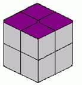</td>
        <td>2<br></td>
        <td>3<br>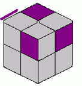</td>
        <td>4<br>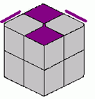</td>
        <td>5<br>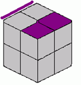</td>
        <td>6<br>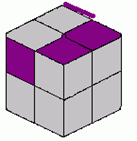</td>
        <td>7<br>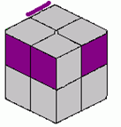</td>
        <td>8<br>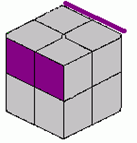</td>
    </tr>
    <tr>
        <td rowspan="3">A</td>
        <td>1</td>
        <td>-</td>
        <td>RU&#39;2R&#39;U&#39;RU&#39;R&#39;(7f)</td>
        <td>R&#39;F2RUR&#39;FR(7f)</td>
        <td>(U&#39;)R2U&#39;RU2R&#39;U2RU&#39;R2(9f)</td>
        <td>RUR&#39;FU&#39;RU&#39;R&#39;U2F2(10f)</td>
        <td>R&#39;F2U2RUR&#39;UF&#39;R(9f)</td>
        <td>(U)FRUR&#39;U&#39;RUR&#39;U&#39;F&#39;(9f)</td>
        <td>R2U2RU2R2(5f)</td>
    </tr>
    <tr>
        <td>2</td>
        <td>(x)RU&#39;RU2R&#39;FRU2R2(9f)</td>
        <td>(U&#39;x)URU2R2F2U2RUR&#39;(9f)</td>
        <td>(U)R2U&#39;RU2R2F&#39;U&#39;F(8f)</td>
        <td>(U)R2UFU2R&#39;URU&#39;B(9f)</td>
        <td>R&#39;FUF&#39;R2URU2R2F (10f)</td>
        <td>R&#39;FU&#39;F&#39;R2U&#39;B2U2R&#39;F&#39;(10f)</td>
        <td>(x)URU2RU2F2R&#39;F&#39;R2 (9f)</td>
        <td>RU&#39;RF&#39;R&#39;FR2F(8f)</td>
    </tr>
    <tr>
        <td>3</td>
        <td>RU&#39;RUR&#39;F2R&#39;U&#39;R&#39;UF2(11f)</td>
        <td>(z&#39;)U2R&#39;UR&#39;F2UR&#39;FR2B(10f)</td>
        <td>R&#39;F2U&#39;FU2F&#39;U&#39;F2U&#39;R (10f)</td>
        <td>(x&#39;)U&#39;R&#39;FU&#39;RU2F&#39;RUR&#39;(10f)</td>
        <td>FRUR&#39;U&#39;FR&#39;2F2(8f)</td>
        <td>F2RU&#39;R&#39;FU&#39;R2B2R&#39;(9f)</td>
        <td>RU&#39;R2U&#39;F2R&#39;U2R&#39;F(9f)</td>
        <td>F2RU2R2F2R&#39;F2(7f)</td>
    </tr>
    <tr>
        <td rowspan="3">B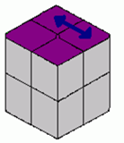</td>
        <td>1</td>
        <td>(x&#39;)RU&#39;RU2R&#39;FRU2R2(9f)</td>
        <td>(U)R&#39;FRF&#39;RUR&#39;(7f)</td>
        <td>(U&#39;)RU&#39;L&#39;UR&#39;U&#39;L(7f)</td>
        <td>(U&#39;)F&#39;RUR&#39;U&#39;R&#39;FR(8f)</td>
        <td>RU&#39;R&#39;U2R&#39;FRF2U2F(10f)</td>
        <td>(U2)R&#39;F&#39;RURU&#39;R&#39;F(8f)</td>
        <td>(U&#39;)R&#39;F2U2y&#39;R&#39;U2RU2RB(9f)</td>
        <td>（U2）RU&#39;R&#39;FU2R2FRU&#39;R(10f)</td>
    </tr>
    <tr>
        <td>2</td>
        <td>(U2)R2UF2U&#39;2R2UR2(7f)</td>
        <td>R&#39;URF2U2F&#39;UF2R2(9f)</td>
        <td>R&#39;FR&#39;F2R&#39;U&#39;F2R2FB(10f)</td>
        <td>R&#39;U2R&#39;F&#39;R2xU&#39;R&#39;U </td>
        <td>(U2)F2U&#39;FU2FRUR&#39; (8f)</td>
        <td>(U2)R&#39;U2FRF&#39;R&#39;FU&#39;R&#39;(9f)</td>
        <td>RU&#39;R&#39;URU&#39;R&#39;FRU&#39;R&#39;(11f)</td>
        <td>(U)R&#39;U&#39;R&#39;F2UF&#39;RF&#39;(8f)</td>
    </tr>
    <tr>
        <td>3</td>
        <td>R&#39;FR&#39;F2RU&#39;R(7f)</td>
        <td>(x)R&#39;UR&#39;UF2R2U&#39;B2R2U&#39;(10f) </td>
        <td>(U)RU2R&#39;F2R&#39;UR&#39;F(8f)</td>
        <td>(U&#39;)R2FU2FRUR2U&#39;R(9f)</td>
        <td>(x)R2U2R&#39;FU&#39;R&#39;U&#39;R&#39;F(9f)</td>
        <td>FU&#39;R2U&#39;R&#39;UR2F&#39;(8f)</td>
        <td>R&#39;UF&#39;RUR&#39;U2F2R(9f)</td>
        <td>(U2)R&#39;U2R&#39;FR2FR2UF&#39;(9f)</td>
    </tr>
    <tr>
        <td rowspan="3">C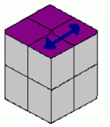</td>
        <td>1</td>
        <td>RU2R&#39;U&#39;RU2L&#39;UR&#39;U&#39;R(11f)</td>
        <td>(U&#39;)R2FRU2F&#39;U2R&#39;F&#39;R2 (9f)</td>
        <td>(U&#39;)R&#39;F2RU2RU&#39;R&#39;F(8f)</td>
        <td>(U&#39;)R&#39;F2R2U2R&#39;UR&#39;F2RF&#39;(10f)</td>
        <td>FU&#39;RUR&#39;U&#39;F&#39;U2y&#39;RU&#39;R&#39;(11f)</td>
        <td>R&#39;F2R&#39;F2RU2R&#39;F2R2(9f)</td>
        <td>RU2R2FRU2y&#39;R&#39;U&#39;R2U&#39;R&#39;(11f)</td>
        <td>(U2)R&#39;U&#39;F2U&#39;F2UF2U2R(9f)</td>
    </tr>
    <tr>
        <td>2</td>
        <td>(U)R2UF2U&#39;2R2UR2(7f)</td>
        <td>R&#39;U&#39;R&#39;F&#39;UF2R2U&#39;R&#39;(9f)</td>
        <td>(U)R&#39;FU2R2BU&#39;(6f)</td>
        <td>FU&#39;RU&#39;R&#39;U&#39;F2R&#39;FR(10f)</td>
        <td>RU&#39;R&#39;FRU&#39;R2FR (9f)</td>
        <td>RU2R2FR&#39;FU&#39;F&#39;R2 (9f)</td>
        <td>R2U&#39;R2U&#39;FR2F2U&#39;RF(10f)</td>
        <td>(U2)RUR&#39;F&#39;RUR&#39;U&#39;RUR&#39;(11f)</td>
    </tr>
    <tr>
        <td>3</td>
        <td>(U&#39;)R&#39;FR&#39;F2RU&#39;R(7f)</td>
        <td>(U2)RUR&#39;UF2R&#39;UR&#39;F (9f)</td>
        <td>(x)U2R&#39;U2FU&#39;FUL(8f)</td>
        <td>(U&#39;)B&#39;U2R&#39;URU2B&#39;R2F2 </td>
        <td>(x)RU&#39;RBU2R&#39;FR&#39;FD (10f)</td>
        <td>R&#39;U&#39;F2U2F&#39;U&#39;FU&#39;FR (10f)</td>
        <td>RU2R&#39;UR2F2R&#39;U&#39;R&#39; (9f)</td>
        <td>R&#39;F2U2RU&#39;R&#39;FU&#39;R(9f)</td>
    </tr>
    <tr>
        <td rowspan="3">D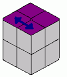</td>
        <td>1</td>
        <td>(U&#39;)RU2R&#39;U&#39;RU2L&#39;UR&#39;U&#39;R(11f)</td>
        <td>(U)F&#39;RUR&#39;U2R&#39;F2R(8f)</td>
        <td>(U&#39;)FR&#39;F&#39;RU&#39;2RU2R&#39;(8f)</td>
        <td>RU&#39;R&#39;U2F2U&#39;F&#39;DRU&#39;R</td>
        <td>(U2)R&#39;FU&#39;F&#39;RU&#39;R&#39;U2FR (10f)</td>
        <td>RUR&#39;U&#39;R&#39;FRF&#39;(8f)</td>
        <td>(U&#39;)R&#39;UR&#39;F&#39;R2U2F&#39;RUR&#39;(10f)</td>
        <td>RU&#39;R&#39;FU2R2FRU&#39;R(10f)</td>
    </tr>
    <tr>
        <td>2</td>
        <td>R2UF2U&#39;2R2UR2(7f)</td>
        <td>(z&#39;)U&#39;R&#39;F2U&#39;F2U2RF&#39;</td>
        <td>(U2)RU&#39;R&#39;F2U2FU&#39;F2(8f)</td>
        <td>(z&#39;)R2URU&#39;R2U&#39;F&#39;U&#39;F2 (9f)</td>
        <td>(U2)R&#39;FRU&#39;F2D&#39;LU&#39;R(9f)</td>
        <td>R2FR&#39;U&#39;R2U&#39;FR(8f)</td>
        <td>(x)UR&#39;U2RUF2U&#39;FRU&#39; (10f)</td>
        <td>(U&#39;)R&#39;U&#39;R&#39;F2UF&#39;RF&#39;(8f)</td>
    </tr>
    <tr>
        <td>3</td>
        <td>R&#39;UR&#39;F2RF&#39;R(7f)</td>
        <td>(x)F&#39;L&#39;U&#39;FU&#39;R2BR2(8f)</td>
        <td>(U&#39;)RU&#39;R&#39;UR2FU&#39;FUR&#39;(10f)</td>
        <td>(U&#39;)RU2R&#39;U2F&#39;U&#39;FR2F2B2 (10f)</td>
        <td>FU&#39;F&#39;R&#39;U2RU2R&#39;F2R(10f)</td>
        <td>FRUFU2FU2R&#39;F2 (9f)</td>
        <td>R2URUF2R&#39;UR&#39;UF&#39; (10f)</td>
        <td>R&#39;U2R&#39;FR2FR2UF&#39;(9f)</td>
    </tr>
    <tr>
        <td rowspan="3">E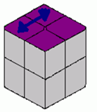</td>
        <td>1</td>
        <td>(Ux&#39;)RU&#39;RU2R&#39;FRU2R2(9f)</td>
        <td>(U)RU&#39;2R&#39;U&#39;2R&#39;FRF&#39;(8f)</td>
        <td>(U&#39;)R2FRU2FU2R&#39;F&#39;R2(9f)</td>
        <td>(U2x&#39;)UR&#39;U&#39;LURU&#39;R&#39;(8f)</td>
        <td>(U&#39;)R&#39;U2F&#39;RU&#39;R&#39;FU2FR(10f)</td>
        <td>(z)RU2R&#39;U&#39;RU2L&#39;UR&#39;U&#39;R(11f)</td>
        <td>(U&#39;)R&#39;F2RU2RU&#39;R2F&#39;RUF(11f)</td>
        <td>R&#39;U&#39;F2U&#39;F2UF2U2R(9f)</td>
    </tr>
    <tr>
        <td>2</td>
        <td>(U&#39;)R2UF2U&#39;2R2UR2(7f)</td>
        <td>(z&#39;)RU&#39;R2U&#39;FU2R&#39;F2R (9f)</td>
        <td>(U2)R2FU&#39;RU&#39;RU&#39;B2(8f)</td>
        <td>R&#39;U2F2R&#39;FDRU&#39;R(9f)</td>
        <td>FRU2R&#39;F2RU2R&#39;F&#39;(9f)</td>
        <td>F&#39;RU2R&#39;F&#39;U2RUR&#39;(9f)</td>
        <td>(x)R&#39;U2RU&#39;FRF&#39;UF2U&#39; (10f)</td>
        <td>RUR&#39;F&#39;RUR&#39;U&#39;RUR&#39;(11f)</td>
    </tr>
    <tr>
        <td>3</td>
        <td>(U&#39;)R&#39;UR&#39;F2RF&#39;R(7f)</td>
        <td>(x)R2U&#39;R2U&#39;FRU2R&#39;F(9f)</td>
        <td>(U&#39;)R&#39;UR&#39;FR2U&#39;BU&#39;B&#39;(9f)</td>
        <td>(U2)R&#39;U2FU&#39;F&#39;U2F&#39;R(8f)</td>
        <td>R&#39;U&#39;R&#39;F2R2U2R&#39;FR(9f)</td>
        <td>R&#39;F2R&#39;F2RU2R (7f)</td>
        <td>RUR&#39;UR2F2R&#39;U2R&#39; (9f)</td>
        <td>(U2)R&#39;F2U2RU&#39;R&#39;FU&#39;R(9f)</td>
    </tr>
    <tr>
        <td rowspan="3">F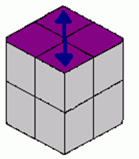</td>
        <td>1</td>
        <td>RU&#39;R&#39;U&#39;F2U&#39;RUR&#39;UF2(11f)</td>
        <td>(U&#39;)R U2R&#39;FR&#39;F&#39;RU&#39;R U&#39;R&#39;(11f)</td>
        <td>(U&#39;)F&#39;RU2R&#39;FU2F&#39;U&#39;F2(9f)</td>
        <td>(U)RU2R&#39;FRU2R2FR (9f)</td>
        <td>FRUR&#39;U&#39;F&#39;(6f)</td>
        <td>(U2)R2U2RU2R&#39;FRF&#39;U&#39;R&#39;(10f)</td>
        <td>(U&#39;)F2R2U&#39;R2FU2FR2U&#39;R2(10f)</td>
        <td>(y&#39;x&#39;)R2UF2U&#39;2R2UR2(7f)</td>
    </tr>
    <tr>
        <td>2</td>
        <td>(z2)R&#39;UR&#39;F2RF&#39;R(7f)</td>
        <td>(y&#39;U)R2UR2U&#39;RU2R&#39;U&#39;RUR&#39;(11f)</td>
        <td>(y&#39;)RU&#39;R&#39;URU2R&#39;UR2U&#39;R2(11f)</td>
        <td>F&#39;U&#39;RU2RUR&#39;F2(8f)</td>
        <td>(y&#39;)R2U&#39;R&#39;U2R&#39;U&#39;2R&#39;(7f)</td>
        <td>R&#39;FR2U&#39;FU2F&#39;R&#39;(8f)</td>
        <td>RU&#39;R2FR2U&#39;R&#39;(7f)</td>
        <td>R2UR&#39;U&#39;RF2U&#39;RUR(10f)</td>
    </tr>
    <tr>
        <td>3</td>
        <td>R2F2R2(3f)</td>
        <td>(U&#39;)R&#39;U&#39;RU&#39;R&#39;U&#39;2R&#39;F2R2(9f)</td>
        <td>R&#39;F2RUR&#39;FR&#39;F2R2(9f)</td>
        <td>RU2R&#39;U2F2R2BR&#39;U(9f)</td>
        <td>FU&#39;R2U&#39;R&#39;U2R&#39;U&#39;R2B&#39;(10f) </td>
        <td>R&#39;FR&#39;FU&#39;FUR2(8f)</td>
        <td>UR&#39;U2R2U&#39;R&#39;F2R2F&#39; (9f)</td>
        <td>R2F2U2RU2R2(6f)</td>
    </tr>
</table>